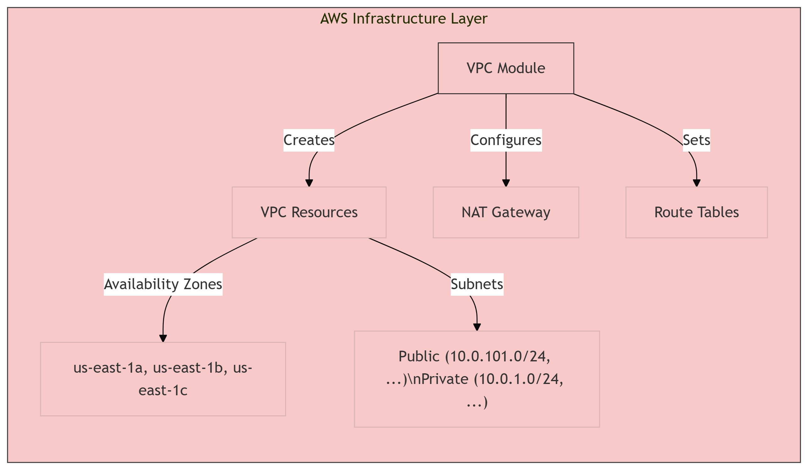
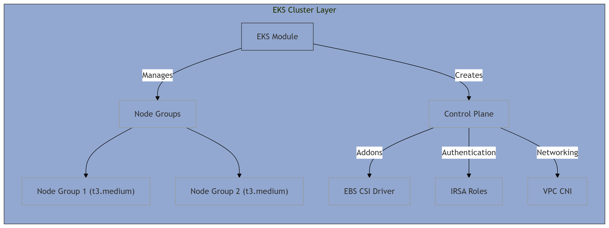
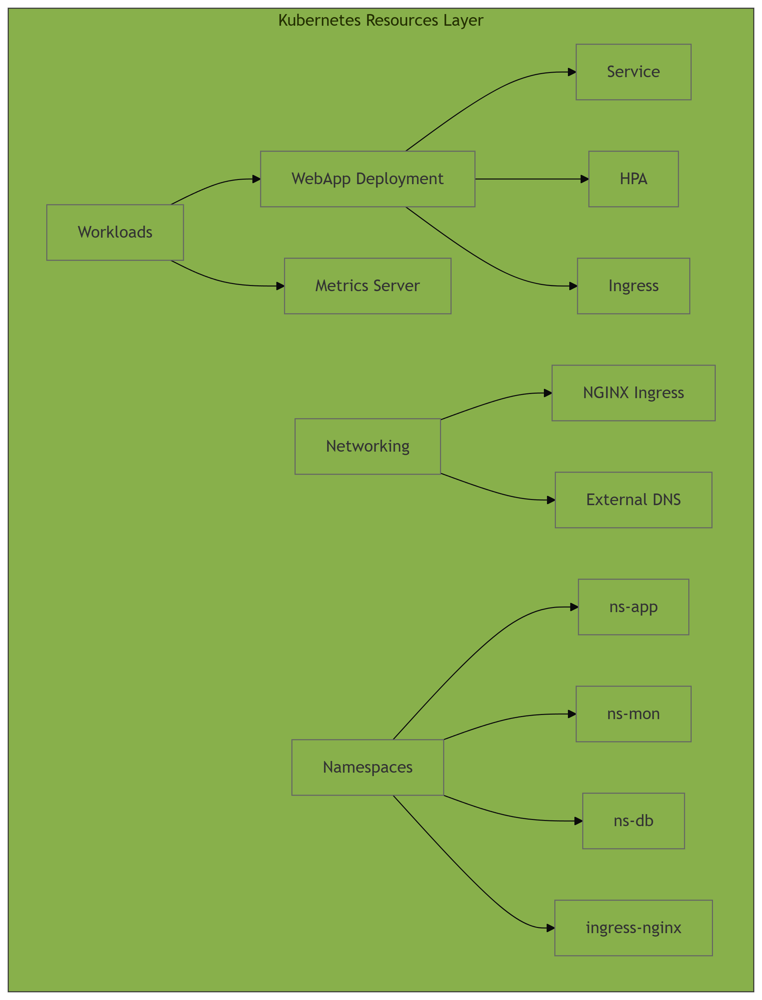

# AWS EKS Infrastructure with Terraform

This Terraform project provisions a complete EKS (Elastic Kubernetes Service) environment on AWS with supporting infrastructure for [ce-grp=3a ecommerce website](https://ce-grp-3a-my-app2.sctp-sandbox.com/)

The infrastructure consists of:

1. **Networking**:
   - VPC with public and private subnets across 3 AZs
   - NAT Gateway for outbound internet access from private subnets
   - Properly tagged subnets for EKS integration

2. **EKS Cluster**:
   - Managed control plane with version 1.32
   - Two managed node groups with t3.medium instances
   - IAM Roles for Service Accounts (IRSA) for EBS CSI driver

3. **Kubernetes Components**:
   - Core namespaces (ns-app, ns-mon, ns-db)
   - NGINX Ingress Controller
   - Sample webapp deployment with HPA
   - Metrics Server for autoscaling
   - External DNS for Route53 integration

4. **Addons**:
   - AWS EBS CSI Driver for persistent storage
   - External DNS for automatic DNS record management

## Key Features

- **High Availability**: Deployed across 3 availability zones
- **Auto-scaling**: Horizontal Pod Autoscaler and cluster autoscaler
- **Security**: IAM roles for service accounts (IRSA)
- **Observability**: Metrics server for resource monitoring
- **CI/CD Ready**: Environment-aware configuration (dev/uat/prod)

## Deployment Workflow

1. VPC provisioning
2. EKS cluster creation
3. Node group deployment
4. Kubernetes addons installation
5. Application deployment
6. Ingress controller setup
7. DNS configuration

## Environment Variables

The infrastructure supports multiple environments through the `grp-prefix` variable:

- `ce-grp-3a-dev-` for development
- `ce-grp-3a-uat-` for user acceptance testing
- `ce-grp-3a-prod-` for production

## Dependencies

- Terraform v1.0+
- AWS provider v5.0+
- kubectl
- helm

## Integration Flow

### AWS Infrastructure Layer

### EKS Cluster Layer

### Kubernetes Resources Layer

---

## EKS Infrastructure CI/CD Pipeline 

This repository provides a CI/CD pipeline for provisioning and managing an AWS Elastic Kubernetes Service (EKS) cluster and its supporting infrastructure using Terraform, automated via GitHub Actions.

---

**Features**

- Automated provisioning of AWS EKS clusters and supporting resources (VPC, S3, DynamoDB, Ingress, External DNS, Namespaces)
- Environment-specific deployments (dev, uat, prod) based on Git branch
- Infrastructure state management using S3 and DynamoDB
- Full Terraform workflow: format checks, validation, plan, and apply
- GitHub Actions integration with detailed plan visibility in pull requests
- Automated state lock cleanup for reliability

---

## How It Works

The pipeline is defined in `eks.yaml` and is triggered on every push to the repository. It determines the deployment environment (dev, uat, prod) based on the branch name and selects the appropriate backend and variable files accordingly.

### Workflow Steps

1. **Checkout Repository**
   - The workflow begins by checking out the repository code.

2. **AWS Credentials Setup**
   - AWS credentials are configured using GitHub Secrets.

3. **Terraform Setup**
   - Terraform is installed and initialized with the specified version.

4. **Code Formatting**
   - Runs `terraform fmt` recursively to enforce code formatting standards.

5. **Environment Detection**
   - The workflow determines which backend and variable files to use based on the branch (`main` for prod, `uat` for UAT, others for dev).

6. **S3 and DynamoDB Bootstrapping**
   - Checks for the existence of the required S3 bucket and DynamoDB table for state management.
   - If missing, initializes and applies Terraform configurations in `bootstrap-s3` and `bootstrap-dynamodb` directories to create them.

7. **Terraform Initialization**
   - Initializes Terraform in the root directory with the correct backend configuration.

8. **VPC & EKS Deployment**
   - Runs a targeted Terraform plan and apply for VPC and EKS modules.

9. **Full Infrastructure Deployment**
   - Runs a full Terraform plan and apply for the remaining resources (Ingress, External DNS, Namespaces, etc.).

10. **State Lock Cleanup**
    - Ensures any leftover Terraform state locks in DynamoDB are force-unlocked to prevent future job failures.

11. **Plan Visibility**
    - Posts the Terraform plan output as a comment on pull requests for transparency and review.

---

## Usage

### Prerequisites

- AWS account with programmatic access
- GitHub repository secrets:
  - `AWS_ACCESS_KEY_ID`
  - `AWS_SECRET_ACCESS_KEY`

### Branch to Environment Mapping

| Branch Name | Environment | Backend Config         | Variable File      |
|-------------|-------------|-----------------------|--------------------|
| main        | Production  | backend-prod.hcl      | env-prod.tfvars    |
| uat         | UAT         | backend-uat.hcl       | env-uat.tfvars     |
| others      | Development | backend-dev.hcl       | env-dev.tfvars     |

### Customization

- **Domain Name:** Set as a repository variable if required by modules (e.g., `DOMAIN_NAME` for External DNS).
- **Additional Resources:** Extend the workflow and Terraform modules as needed for your infrastructure.

---

## File Structure Overview

- `eks.yaml`: Main GitHub Actions workflow file for CI/CD automation
- `bootstrap-s3/`: Terraform config for S3 backend
- `bootstrap-dynamodb/`: Terraform config for DynamoDB state lock table
- `backend-*.hcl`: Terraform backend configuration files per environment
- `env-*.tfvars`: Terraform variable files per environment

---

## Security

- All AWS credentials are managed via GitHub Secrets.
- State files are stored securely in S3 with locking via DynamoDB.

---

## Troubleshooting

- **State Lock Issues:** The workflow includes an automatic force-unlock step for DynamoDB state locks if a job is cancelled or fails.
- **Missing Resources:** The workflow will automatically create missing S3 or DynamoDB resources as needed.

---

## Contributing

Contributions are welcome! Please open issues or submit pull requests for improvements or bug fixes.

---

## License

This repository is licensed under the MIT License.

---

> For detailed workflow logic, see the `eks.yaml` file in the `.github/workflows` directory.