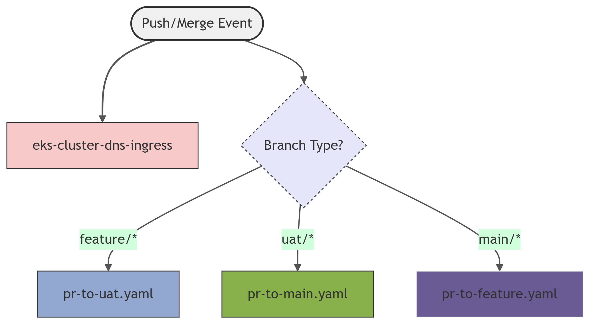
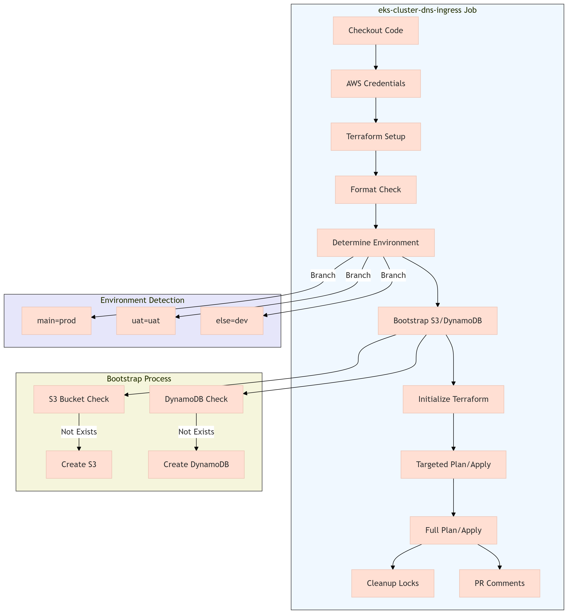

# AWS EKS Infrastructure with Terraform

This Terraform project provisions a complete EKS (Elastic Kubernetes Service) environment on AWS with supporting infrastructure for [ce-grp=3a ecommerce website](https://ce-grp-3a-my-app2.sctp-sandbox.com/)

The infrastructure consists of:

1. **Networking**:
   - VPC with public and private subnets across 3 AZs
   - NAT Gateway for outbound internet access from private subnets
   - Properly tagged subnets for EKS integration

2. **EKS Cluster**:
   - Managed control plane with version 1.32
   - Two managed node groups with t3.medium instances
   - IAM Roles for Service Accounts (IRSA) for EBS CSI driver

3. **Kubernetes Components**:
   - Core namespaces (ns-app, ns-mon, ns-db)
   - NGINX Ingress Controller
   - Sample webapp deployment with HPA
   - Metrics Server for autoscaling
   - External DNS for Route53 integration

4. **Addons**:
   - AWS EBS CSI Driver for persistent storage
   - External DNS for automatic DNS record management

## Key Features

- **High Availability**: Deployed across 3 availability zones
- **Auto-scaling**: Horizontal Pod Autoscaler and cluster autoscaler
- **Security**: IAM roles for service accounts (IRSA)
- **Observability**: Metrics server for resource monitoring
- **CI/CD Ready**: Environment-aware configuration (dev/uat/prod)

## Deployment Workflow

1. VPC provisioning
2. EKS cluster creation
3. Node group deployment
4. Kubernetes addons installation
5. Application deployment
6. Ingress controller setup
7. DNS configuration

## Environment Variables

The infrastructure supports multiple environments through the `grp-prefix` variable:

- `ce-grp-3a-dev-` for development
- `ce-grp-3a-uat-` for user acceptance testing
- `ce-grp-3a-prod-` for production

## Dependencies

- Terraform v1.0+
- AWS provider v5.0+
- kubectl
- helm

## Integration Flow

### AWS Infrastructure Layer

### EKS Cluster Layer

### Kubernetes Resources Layer

---

## EKS Infrastructure CI/CD Pipeline 

This repository provides a CI/CD pipeline for provisioning and managing an AWS Elastic Kubernetes Service (EKS) cluster and its supporting infrastructure using Terraform, automated via GitHub Actions.

[Push/Merge Event]
  │
  ├─→ eks-cluster-dns-ingress (eks.yaml) (All branches)
  │
  └─→ Branch Type?
      ├─ feature/* → pr-to-uat.yaml
      ├─ uat/* → pr-to-main.yaml
      └─ main/* → pr-to-feature.yaml

---

**Features**

- Automated provisioning of AWS EKS clusters and supporting resources (VPC, S3, DynamoDB, Ingress, External DNS, Namespaces)
- Environment-specific deployments (dev, uat, prod) based on Git branch
- Infrastructure state management using S3 and DynamoDB
- Full Terraform workflow: format checks, validation, plan, and apply
- GitHub Actions integration with detailed plan visibility in pull requests
- Automated state lock cleanup for reliability

---

### Workflow Steps of eks.yaml

---

## Usage

### Prerequisites

- AWS account with programmatic access
- GitHub repository secrets:
  - `AWS_ACCESS_KEY_ID`
  - `AWS_SECRET_ACCESS_KEY`

### Branch to Environment Mapping

| Branch Name | Environment | Backend Config         | Variable File      |
|-------------|-------------|-----------------------|--------------------|
| main        | Production  | backend-prod.hcl      | env-prod.tfvars    |
| uat         | UAT         | backend-uat.hcl       | env-uat.tfvars     |
| others      | Development | backend-dev.hcl       | env-dev.tfvars     |

### Customization

- **Domain Name:** Set as a repository variable if required by modules (e.g., `DOMAIN_NAME` for External DNS).
- **Additional Resources:** Extend the workflow and Terraform modules as needed for your infrastructure.

---

## File Structure Overview

- `eks.yaml`: Main GitHub Actions workflow file for CI/CD automation
- `bootstrap-s3/`: Terraform config for S3 backend
- `bootstrap-dynamodb/`: Terraform config for DynamoDB state lock table
- `backend-*.hcl`: Terraform backend configuration files per environment
- `env-*.tfvars`: Terraform variable files per environment

---

## Security

- All AWS credentials are managed via GitHub Secrets.
- State files are stored securely in S3 with locking via DynamoDB.

---

## Troubleshooting

- **State Lock Issues:** The workflow includes an automatic force-unlock step for DynamoDB state locks if a job is cancelled or fails.
- **Missing Resources:** The workflow will automatically create missing S3 or DynamoDB resources as needed.

---

## Contributing

Contributions are welcome! Please open issues or submit pull requests for improvements or bug fixes.

---

## License

This repository is licensed under the MIT License.

---

